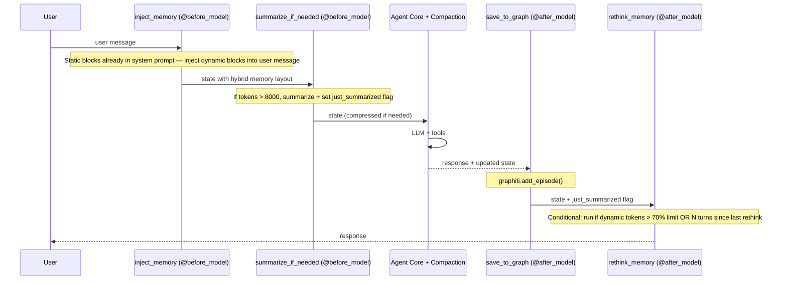

# Middleware Stack — Order and Responsibilities

The order matters. Each middleware wraps the next in an onion model.

## Full Stack

```mermaid
flowchart TB
    INPUT[User Input] --> MW1

    subgraph BUILTIN[Built-in Deep Agents (1-5)]
        MW1[1. TodoListMiddleware — Task planning]
        MW2[2. SubAgentMiddleware — Specialist delegation]
        MW3[3. SkillsMiddleware — Dynamic skill loading]
        MW4[4. FilesystemMiddleware — File operations]
        MW5[5. CompactionMiddleware — Context management]
    end

    subgraph CUSTOM[Custom Sentient Agent (6-9)]
        MW6[6. inject_memory — @before_model: dynamic blocks into user msg]
        MW7[7. summarize_if_needed — @before_model: compress if tokens > 8000]
        MW8[8. save_to_graph — @after_model: graphiti.add_episode]
        MW9[9. rethink_memory — @after_model: conditional block updates]
    end

    MW1 --> MW2 --> MW3 --> MW4 --> MW5
    MW5 --> MW6 --> MW7 --> MW8 --> MW9

    MW9 --> CORE[Agent Core (LLM + Tools)]
    CORE --> OUTPUT[Agent Response]

```

## Per-Turn Lifecycle



## Key Decisions

| Decision | Reason |
|---|---|
| **Onion model** | Each middleware can intercept before and after the turn, maintaining separation of concerns |
| **Compaction before custom hooks** | Compaction is native and handles immediate overflow; custom hooks handle intelligent processing |
| **@before_model hooks run first** | inject_memory and summarize_if_needed prepare state before the LLM call |
| **@after_model hooks run last** | save_to_graph and rethink_memory process results after the LLM responds |
| **rethink_memory is conditional** | Only runs when dynamic tokens exceed 70% of the configurable limit (default 20K) or N messages since last rethink (default 10). Avoids unnecessary LLM calls every turn |
| **inject_memory splits static/dynamic** | Static blocks (persona, user_profile) in system prompt for cache stability; dynamic blocks (preferences, working_context, learnings) in user message |
| **Custom hooks (6-9) are separate** | Can be implemented incrementally without affecting the 5 built-in middlewares |
