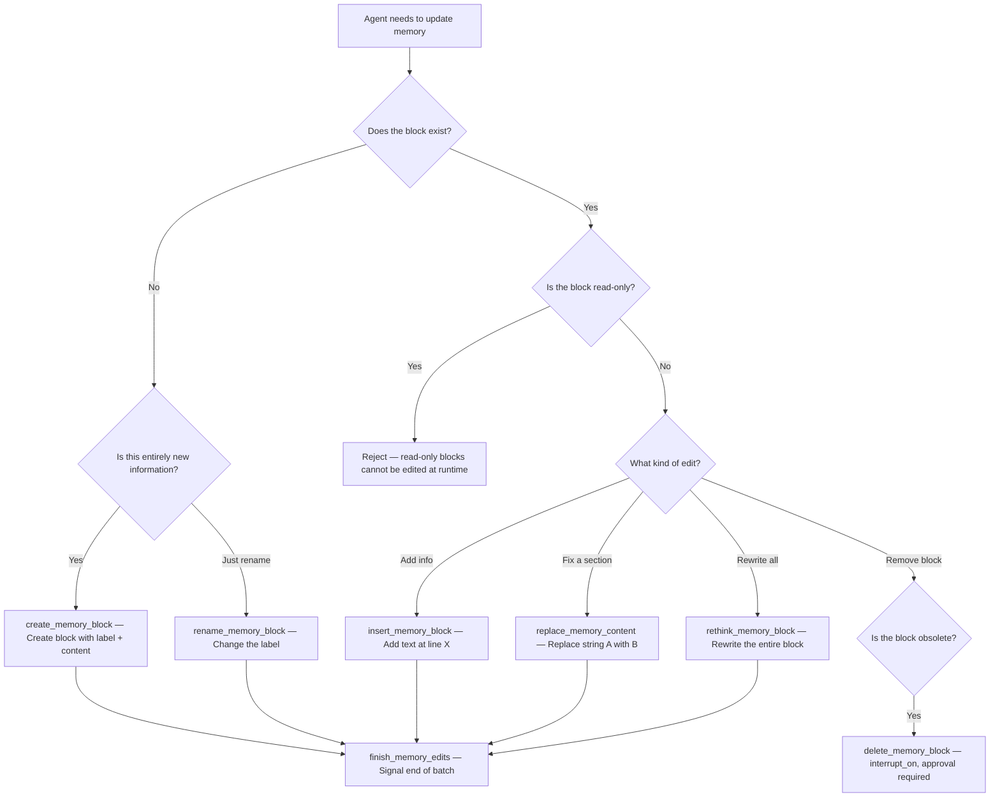
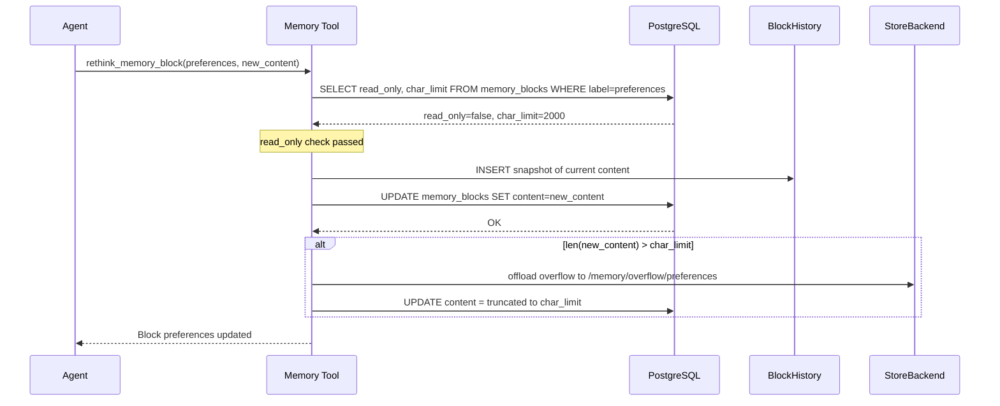

# Memory Tools — Autonomous Editing Flow

The agent has 8 tools to manage its own structured memory (Layer 1). This gives the agent auditable control over its own beliefs.

## Taxonomy of the 8 Tools

```mermaid
flowchart LR
    subgraph READ[Read]
        VIEW[view_memory_blocks — View all or a specific block]
    end

    subgraph WRITE[Write (read-only blocks rejected)]
        INSERT[insert_memory_block — Insert text at a specific line]
        REPLACE[replace_memory_content — Replace a string in the block]
        RETHINK[rethink_memory_block — Rewrite the entire block]
    end

    subgraph LIFECYCLE[Lifecycle (read-only blocks rejected)]
        CREATE[create_memory_block — Create new block with label]
        DELETE[delete_memory_block — Requires human approval]
        RENAME[rename_memory_block — Change block label]
    end

    subgraph SIGNAL[Signal]
        FINISH[finish_memory_edits — Signal end of batch edits]
    end

```

## Decision Flow: Which tool to use?



## Versioning (BlockHistory)



## Key Decisions

- **8 granular tools** — Instead of a single `update_memory`, the agent has specific operations (insert, replace, rethink). This produces more readable traces in LangFuse and enables precise auditing of what changed.
- **read-only enforcement** — All write and lifecycle tools check `read_only` before executing. Read-only blocks (like `persona`) are injected into context but cannot be modified by the agent at runtime. Only the builder can change them.
- **char_limit per block** — Every block has a maximum character count. At 80% of the limit, the `rethink_memory` hook auto-compresses. If still over after compression, overflow is offloaded to StoreBackend.
- **`delete_memory_block` with interrupt** — The only tool that pauses for human approval. Memory deletion is irreversible (even with BlockHistory, the agent doesn't autonomously consult the history).
- **`finish_memory_edits` as a signal** — Lets the system know when the agent finished a batch of edits, enabling cache flush or notifications.
- **`rethink_memory_block` vs `replace_memory_content`** — `rethink` rewrites completely (for perspective shifts); `replace` does surgical substitution (for targeted corrections).
- **rethink_memory is conditional** — The `rethink_memory` hook (`@after_model`) does NOT run every turn. It triggers only when a block reaches 80% of its `char_limit`, dynamic block tokens exceed 70% of the context budget, or N messages have passed since the last rethink.
