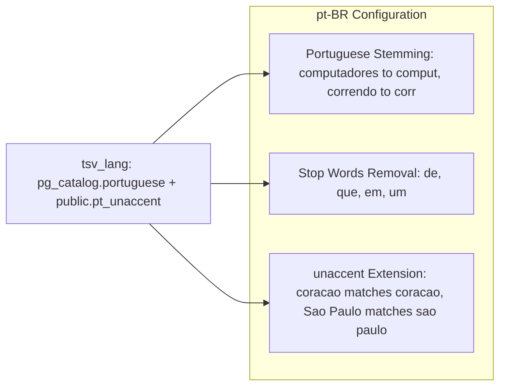

# RAG Pipeline — Contextual Retrieval

The RAG pipeline uses Contextual Retrieval: each chunk receives document-level context before embedding, dramatically improving search accuracy.

## Ingestion Pipeline

```mermaid
flowchart LR
    subgraph INPUT[Input]
        DOCS[Documents: PDF, DOCX, MD, TXT, CSV, HTML...]
    end

    subgraph PIPELINE[LlamaIndex IngestionPipeline]
        direction TB
        LOAD[1. SimpleDirectoryReader — Load documents]
        CHUNK[2. SentenceSplitter — 512 tokens, 50 overlap]
        CTX[3. Context Generation — LLM generates context per chunk]
        PREPEND[4. Prepend Context — Add context to the beginning of each chunk]
        EMBED[5. Embedding Model — text-embedding-3-small (1536 dims)]
    end

    subgraph STORE[Storage]
        PGV[(PostgreSQL + pgvector | Namespace: kb_docs | Hybrid Search Config)]
    end

    DOCS --> LOAD --> CHUNK --> CTX --> PREPEND --> EMBED --> PGV

```

## Contextual Retrieval — Before vs After

```mermaid
flowchart TB
    subgraph BEFORE[Traditional RAG]
        direction LR
        C1[Chunk: The policy allows 30 days for refunds]
        E1[Chunk embedding (no context)]
        C1 --> E1
    end

    subgraph AFTER[Contextual Retrieval]
        direction LR
        C2[Chunk: The policy allows 30 days for refunds]
        CTX2[Generated context: This excerpt is from section 4.2 of the Customer Service Manual, about return policies]
        MERGED[Contextualized chunk: context + original chunk]
        E2[Enriched embedding (with context)]
        C2 --> CTX2 --> MERGED --> E2
    end

```

## Hybrid Search (Retrieval)

```mermaid
flowchart TB
    QUERY[User Query: refund policy]

    subgraph HYBRID[Hybrid Search (PGVectorStore)]
        direction LR
        VEC[Vector Search — pgvector similarity (top 10)]
        KW[Keyword Search — tsvector full-text, pg_catalog.portuguese (top 10)]
    end

    RRF[Reciprocal Rank Fusion (RRF, k=60) — Combine rankings]

    RESULTS[Top-K Results — Ranked by combined relevance]

    QUERY --> VEC
    QUERY --> KW
    VEC --> RRF
    KW --> RRF
    RRF --> RESULTS

```

## Portuguese Language Support



## Key Decisions

- **Contextual Retrieval vs standard RAG** — Isolated chunks lose context ("30 days" of what?). The LLM-generated context situates each chunk within its document, eliminating ambiguity.
- **LlamaIndex vs LangChain for ingestion** — LlamaIndex has `IngestionPipeline` with native parallelism and `SentenceSplitter` optimized for retrieval.
- **Hybrid Search with RRF** — Neither embeddings alone nor keywords alone are sufficient. RRF combines both rankings, capturing both semantic meaning and exact terms.
- **Portuguese full-text** — `pg_catalog.portuguese` handles stemming and stop words natively. The `unaccent` extension is critical for pt-BR where users search without accents.
