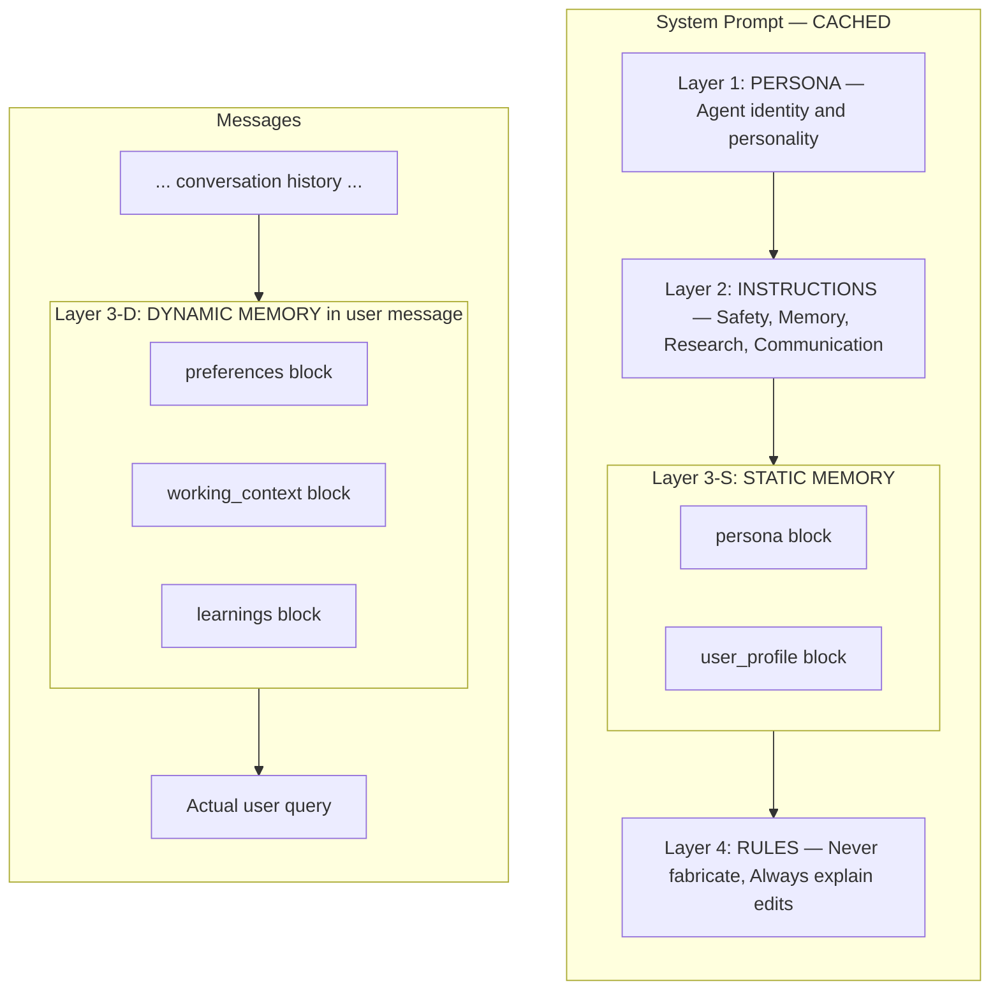

# Prompt Engineering — Hybrid Memory Injection + 4-Layer System Prompt

The system prompt follows a 4-layer hierarchy. Static memory blocks (persona, user_profile) live in the system prompt for KV-cache stability. Dynamic blocks (preferences, working_context, learnings) are injected into the user message to avoid cache invalidation.

## System Prompt Hierarchy (Hybrid Injection)



## KV-Cache Optimization (Hybrid Benefit)

```mermaid
flowchart LR
    subgraph TURN1[Turn 1]
        direction TB
        T1_P[Persona — cached]
        T1_I[Instructions — cached]
        T1_SM[Static Memory: persona, profile — cached]
        T1_R[Rules — cached]
        T1_DM[User msg: preferences + context + learnings v1]
    end

    subgraph TURN2[Turn 2]
        direction TB
        T2_P[Persona — cache hit]
        T2_I[Instructions — cache hit]
        T2_SM[Static Memory — cache hit]
        T2_R[Rules — cache hit]
        T2_DM[User msg: preferences + context + learnings v2 changed]
    end

    TURN1 -.->|Entire system prompt = cache hit — dynamic changes in user msg only| TURN2
```



## Memory Check Hierarchy — Investigate Before Answering

```mermaid
flowchart TD
    Q[Agent receives a question]

    T1{Tier 1: Is it in the memory blocks? (already in context)}
    T2{Tier 2: Is it a factual question?}
    T3{Tier 3: Does it involve relationships or temporality?}
    T4[Tier 4: Complex question — search multiple layers]

    A1[Answer directly (Layer 1 already injected)]
    A2_KB[search_knowledge_base (Layer 2 — kb_docs)]
    A2_CH[search_conversation_history (Layer 2 — conversations)]
    A3[search_knowledge_graph (Layer 3 — Graphiti)]
    A4[Search Layer 2 + Layer 3, then synthesize results]

    Q --> T1
    T1 -->|Yes (persona, preferences, user_profile)| A1
    T1 -->|No| T2
    T2 -->|Factual/domain| A2_KB
    T2 -->|What did we discuss?| A2_CH
    T2 -->|No| T3
    T3 -->|Yes| A3
    T3 -->|Complex| T4
    T4 --> A4

```

## Key Decisions

- **Hybrid memory injection** — Static blocks (persona, user_profile) stay in the system prompt because they rarely change. Dynamic blocks (preferences, working_context, learnings) go into the user message because they change frequently. This ensures the entire system prompt is a KV-cache hit across turns.
- **Why not all blocks in system prompt?** — A single-token change anywhere in the system prompt invalidates the entire KV-cache prefix. Dynamic blocks change often, so placing them in user messages preserves cache stability.
- **4 separate layers** — Persona (identity) never mixes with Instructions (behavior). This prevents the agent from confusing who it is with what it should do.
- **WHY in every instruction** — Instructions with motivation generalize better than bare rules. If you can't explain the why, the rule probably isn't necessary.
- **Memory Check Hierarchy** — The agent NEVER speculates when a tool can provide a verified answer. There's a 4-tier protocol to decide where to search.
- **Error Preservation** — When `summarize_if_needed` compresses history, failed tool calls are preserved so the agent learns from its own mistakes.
