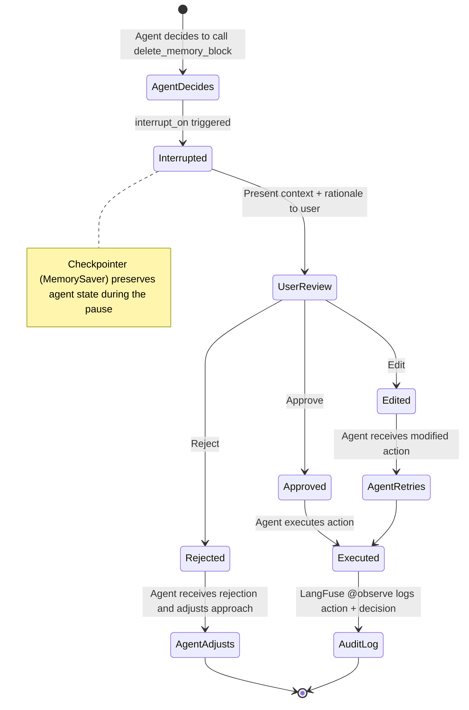
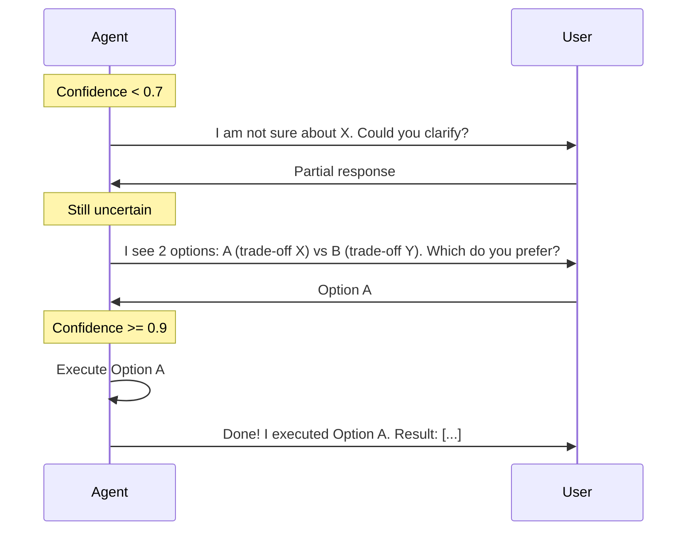

# Human-in-the-Loop — Approval and Escalation

Not every agent action needs approval. The system defines clear boundaries based on risk and reversibility.

## Action Categorization Matrix

```mermaid
flowchart TB
    subgraph SAFE[Auto-execute — Low Risk, Reversible]
        direction LR
        VIEW[view_memory_blocks — Read-only]
        SEARCH[search_knowledge_base — Read-only]
        INSERT[insert_memory_block — Low-stakes write]
        REPLACE[replace_memory_content — Low-stakes write]
        RETHINK[rethink_memory_block — Low-stakes write]
    end

    subgraph DANGER[Always Approve — High Risk or Irreversible]
        direction LR
        DELETE[delete_memory_block — Destructive]
        EMAIL[send_email — Irreversible]
        API[external_api_call — External side-effect]
        DBMUT[database_mutation — Irreversible]
    end

    SAFE -.->|No approval needed| OK[Agent proceeds]
    DANGER -->|interrupt_on requires approval| REVIEW[Human Review: Approve | Edit | Reject]
```

## Approval Flow (interrupt_on)



## Confidence-Based Escalation

```mermaid
flowchart TD
    ACTION[Agent wants to execute a state-modifying action]

    ASSESS[Assess confidence (0.0 - 1.0)]

    C09{>= 0.9?}
    C07{>= 0.7?}
    C05{>= 0.5?}
    C03{>= 0.3?}

    AUTO[Auto-execute — Execute and briefly explain]
    SUGGEST[Suggest and Wait — I can do X. Should I proceed?]
    ESCALATE[Escalate — Explain uncertainty and ask for guidance]
    REFUSE[Refuse — State uncertainty and request clarification]

    ACTION --> ASSESS --> C09
    C09 -->|Yes| AUTO
    C09 -->|No| C07
    C07 -->|Yes| SUGGEST
    C07 -->|No| C05
    C05 -->|Yes| ESCALATE
    C05 -->|No| C03
    C03 -->|Yes| ESCALATE
    C03 -->|No| REFUSE

```

## Graduated Escalation Pattern



## Key Decisions

- **Only `delete_memory_block` has a hard interrupt** — All other memory operations are reversible (BlockHistory). Deleting is the only truly destructive action.
- **Confidence thresholds in the prompt, not in code** — Thresholds are system prompt instructions, not programmatic logic. This gives the model flexibility to interpret context.
- **3 options (Approve/Edit/Reject)** — Binary Approve/Reject is limiting. "Edit" lets the user correct the action without fully rejecting it.
- **Audit trail via LangFuse** — Every approved action is logged with `@observe`, including who approved it and when. Essential for compliance.
- **Default safety: when in doubt, ask** — A false positive (unnecessary approval request) is always better than a false negative (unauthorized action).
