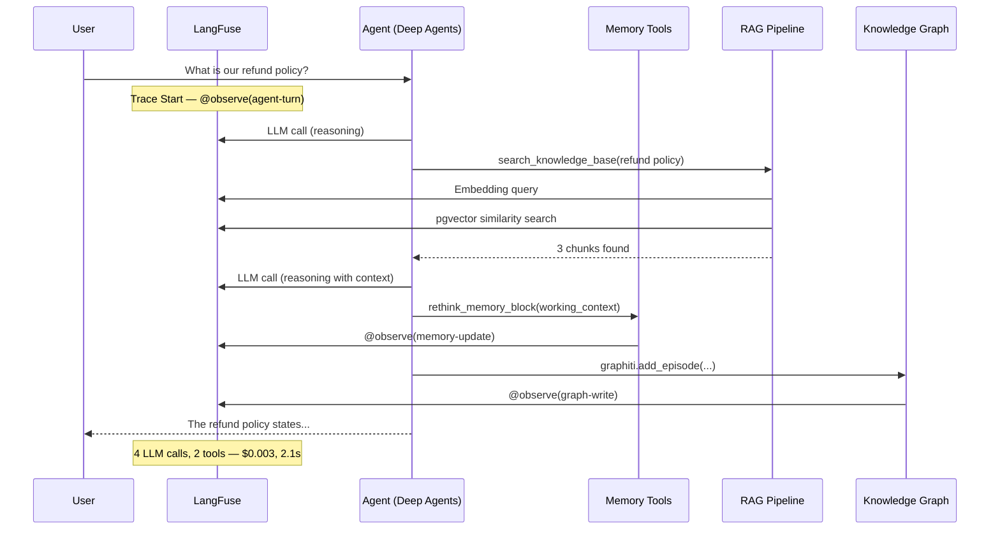

# Observability — LangFuse with 3 Integration Points

Observability is a priority from day one. Each system layer is traced independently via LangFuse.

## 3 Integration Points

```mermaid
flowchart TB
    subgraph AGENT_TURN[Agent Turn]
        direction TB

        subgraph P1[Point 1: Deep Agents / LangChain]
            LC[CallbackHandler: LLM calls, tools, tokens, latency]
        end

        subgraph P2[Point 2: LlamaIndex RAG]
            LI[LlamaIndexInstrumentor: Ingestion, embeddings, retrieval, re-ranking]
        end

        subgraph P3[Point 3: Custom Operations]
            OB[@observe() decorator: Memory, Graphiti, approvals, custom logic]
        end
    end

    subgraph LANGFUSE[LangFuse Dashboard]
        direction LR
        TRACES[Traces — Complete call chains]
        EVAL[Evaluations — Relevance, faithfulness, helpfulness]
        COST[Cost Tracking — Per model, per session]
        PROMPT[Prompt Management — Versioning and deploy]
    end

    P1 -->|callbacks| TRACES
    P2 -->|OpenInference| TRACES
    P3 -->|decorator| TRACES
    TRACES --> EVAL
    TRACES --> COST
    TRACES --> PROMPT

```

## Complete Trace of a Single Turn



## Evaluation Pipeline

```mermaid
flowchart LR
    subgraph INPUT[Data]
        TRACE[Complete trace (input + output + context)]
    end

    subgraph JUDGES[LLM-as-Judge Evaluators]
        direction TB
        REL[Relevance — Does the answer address the question?]
        FAITH[Faithfulness — Is the answer grounded in retrieved context?]
        HELP[Helpfulness — Was the response useful to the user?]
    end

    subgraph SCORES[Scores]
        S1[Score: 0.0 - 1.0]
        FB[User Feedback: thumbs up / thumbs down]
    end

    TRACE --> REL & FAITH & HELP
    REL & FAITH & HELP --> S1
    S1 --> DASHBOARD[LangFuse Dashboard — Aggregated metrics per session/period]
    FB --> DASHBOARD

```

## Key Decisions

- **LangFuse vs LangSmith** — LangFuse is open-source and self-hostable; LangSmith is vendor-locked. LangFuse natively integrates with both LangChain AND LlamaIndex.
- **3 separate integration points** — Each layer has its own tracing mechanism, ensuring no operation goes untracked. CallbackHandler for LangChain, OpenInference for LlamaIndex, `@observe` for custom code.
- **Observability from day 1** — Adding tracing after the fact is exponentially harder. The cost of unused traces early on is negligible compared to the cost of missing traces when a production bug surfaces.
- **PostHog integration** — LangFuse has native PostHog integration to connect LLM metrics with product analytics.
- **rethink_memory traces are conditional** — The rethink trace only appears when the `@after_model` hook actually runs (dynamic tokens > 70% limit or N turns since last rethink), not every turn. This keeps the trace dashboard clean.
