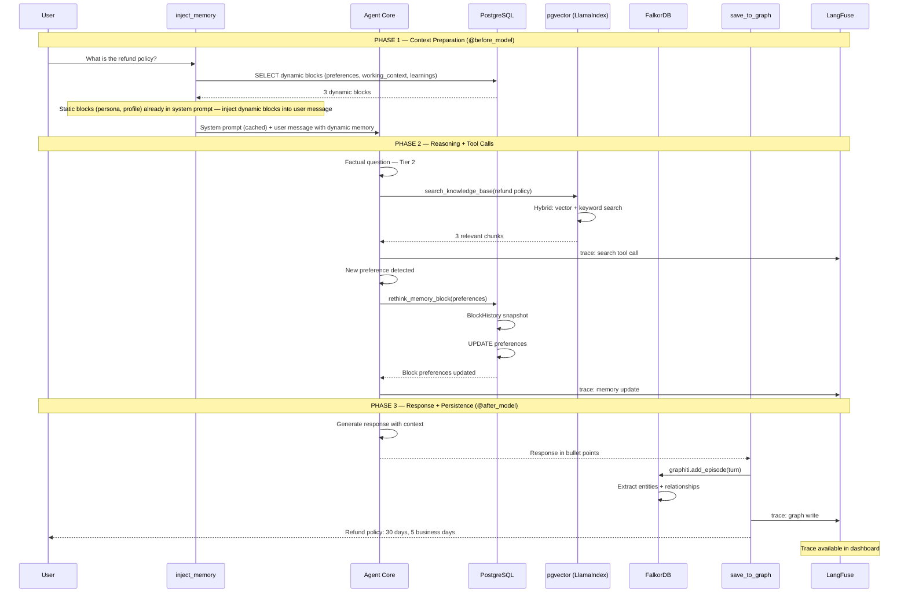

# Data Flow End-to-End — A Complete Turn

Complete data flow of an agent turn, from user input to final response, showing all layers involved.

## Scenario: User asks a factual question and shares a preference



## Macro View: Where each data type lives

```mermaid
flowchart TB
    subgraph USER_DATA[User Data]
        PROFILE[Profile and Preferences]
        DOCS[Documents / KB]
        CONV[Conversations]
    end

    subgraph STORAGE[Where each data type is stored]
        subgraph PG[PostgreSQL]
            MB[memory_blocks (Layer 1) — with char_limit + read_only]
            BH[block_history (audit trail)]
            KB[kb_docs (Layer 2 — pgvector)]
            CV[conversations (Layer 2 — pgvector)]
        end
        subgraph FK[FalkorDB]
            NODES[Entity Nodes (Layer 3)]
            EDGES[Entity Edges / Facts (Layer 3)]
            EP[Episodes (Layer 3)]
        end
        subgraph DA[Deep Agents StoreBackend]
            OVERFLOW[/memory/overflow/ — offloaded block content]
        end
    end

    PROFILE -->|rethink_memory_block| MB
    MB -->|every edit| BH
    MB -.->|when block exceeds char_limit| OVERFLOW
    DOCS -->|ingest_documents.py| KB
    CONV -->|automatic embedding| CV
    CONV -->|automatic add_episode| EP
    EP -->|automatic extraction| NODES
    EP -->|automatic extraction| EDGES

```

## Infrastructure (Docker Compose)

```mermaid
flowchart LR
    subgraph DOCKER[docker-compose.yml]
        subgraph PG_SVC[postgres]
            PG_IMG[PostgreSQL 17 + pgvector extension]
            PG_PORT[Port: 5432]
            PG_DB[DB: agent_memory]
            PG_HEALTH[Healthcheck: pg_isready]
        end
        subgraph FK_SVC[falkordb]
            FK_IMG[FalkorDB (Redis protocol)]
            FK_PORT1[Port: 6379 (Redis)]
            FK_PORT2[Port: 3000 (Browser UI)]
            FK_HEALTH[Healthcheck: redis-cli ping]
        end
    end

    APP[Agent Application] -->|SQLAlchemy + LlamaIndex pgvector| PG_SVC
    APP -->|Graphiti FalkorDriver| FK_SVC

```
